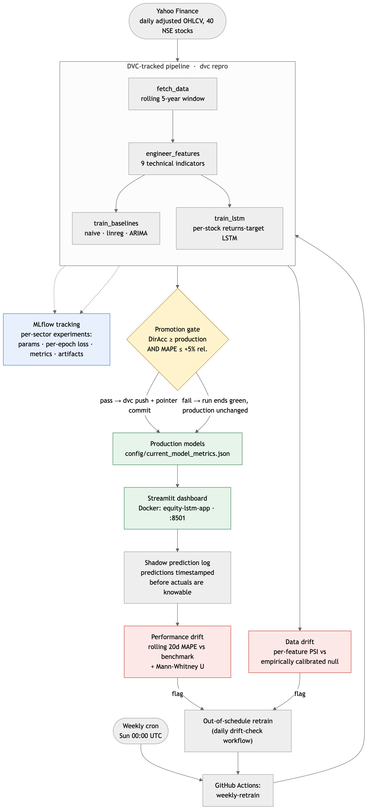
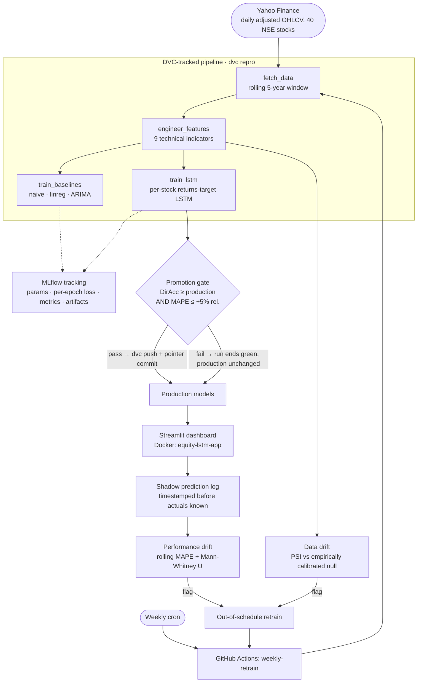
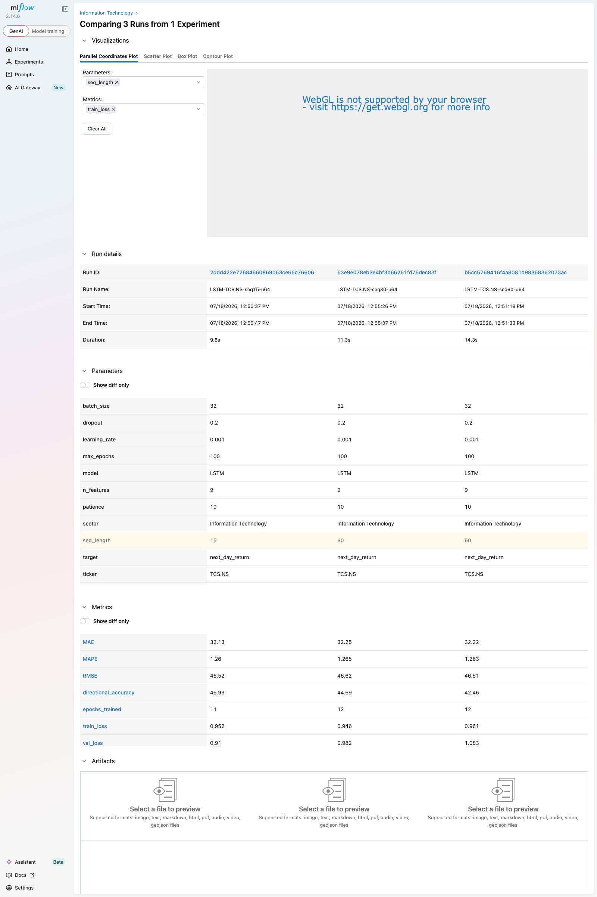
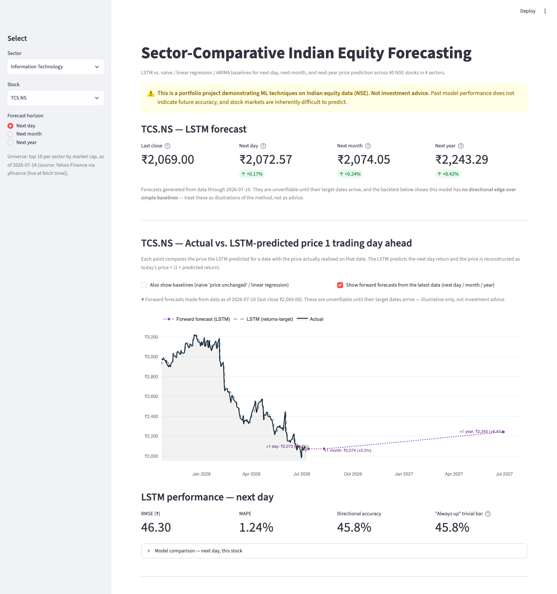
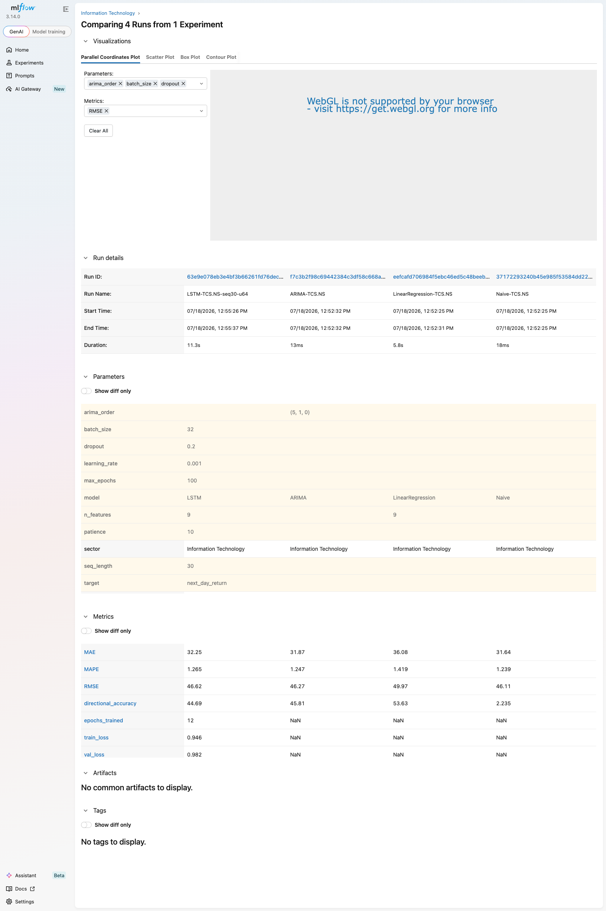

# Sector-Comparative Indian Equity Forecasting — an end-to-end MLOps system

**An honest LSTM-vs-baselines comparison across 40 NSE stocks, wrapped in a production-grade ML system: DVC-versioned pipeline, MLflow experiment tracking, gated automated retraining, statistical drift detection, and Docker packaging.**

🔗 **Live demo:** [sector-comparative-equity-lstm.streamlit.app](https://sector-comparative-equity-lstm.streamlit.app)



<details>
<summary>Diagram source (Mermaid — renders on GitHub)</summary>


</details>

> **Not investment advice.** This is a portfolio project demonstrating ML engineering on Indian equity data. Stock-price predictability is fundamentally limited by market efficiency; the point is a *rigorous, honest* model comparison and the system around it — not a trading signal.

---

## The original finding (still the intellectual core)

For next-day price prediction, **the LSTM did not beat the simpler models — anywhere.** Evaluated identically (same chronological 70/15/15 split, same information cutoff, same metrics, all 40 stocks):

| | Naive | LinReg | ARIMA | LSTM (price) | **LSTM (returns)** |
|---|---|---|---|---|---|
| Mean MAPE | 1.25% | 1.42% | 1.26% | 4.31% | **1.28%** |
| Mean directional accuracy | 2.6%* | 48.7% | 50.0% | 50.1% | **48.3%** |
| RMSE wins (of 40 stocks) | 24 | 0 | 9 | 0 | **7** |

\* Naive always predicts "no change" — its near-zero directional score quantifies how a low-error model can have zero predictive skill.

The price-target LSTM's 4.31% MAPE was **diagnosed** (a train-fit output scaler cannot extrapolate beyond the training price range), the diagnosis was **tested** by changing exactly one variable (target: price level → daily return), and the fix improved **all 40 of 40 stocks** — while directional accuracy stayed at a coin flip, because better target representation cannot create signal the features don't contain. At longer horizons the market's difficulty compounds: at one month no model beats "assume no change"; at one year the evaluation itself breaks down (~2 independent annual windows per stock). Full analysis: the [notebooks](notebooks/) and per-stock numbers in [results/](results/).

---

## What the MLOps layer adds

**Originally:** a one-time trained model in a notebook — retraining meant re-running cells by hand, results lived in overwritten CSVs, and nobody would notice if live accuracy quietly rotted.

**Now:** a versioned, tracked, self-monitoring, containerized ML *system*:

| Component | Why it exists |
|---|---|
| **DVC pipeline** ([docs/DVC_SETUP.md](docs/DVC_SETUP.md)) | Data and models are content-addressed and reproducible — `dvc repro` re-runs only what a change actually affects, and `dvc.lock` pins exactly which data + code produced the tracked artifacts. Answers: *"can I reproduce this model?"* |
| **MLflow tracking** ([docs/MLFLOW_SETUP.md](docs/MLFLOW_SETUP.md)) | Every training run — every baseline, every LSTM config — logs params, per-epoch losses, test metrics, and the model artifact into per-sector experiments. Nothing is lost when a retrain overwrites the CSVs. Answers: *"which configuration was best, and why?"* |
| **Gated retraining** ([.github/workflows/retrain.yml](.github/workflows/retrain.yml)) | Weekly GitHub Actions retrain with a **promotion gate**: the new model replaces production only if directional accuracy hasn't regressed AND MAPE is within +5% relative. Blind auto-replacement is worse than no automation — one bad data fetch would silently degrade production. Both accept and reject paths are [proven](results/retraining_logs/). |
| **Drift detection** ([docs/DRIFT_DETECTION.md](docs/DRIFT_DETECTION.md)) | Daily check that makes retraining event-driven: performance drift (rolling live MAPE vs training benchmark, Mann-Whitney-confirmed) and data drift (per-feature PSI against an *empirically calibrated* null — the textbook 0.25 cutoff false-alarms on autocorrelated windows). Data drift catches regime changes and broken feeds days before enough errors accumulate for performance drift to see them. |
| **Docker** ([docs/DOCKER_SETUP.md](docs/DOCKER_SETUP.md)) | The whole system runs identically anywhere: a lean always-on app image (no TensorFlow) and a heavy on-demand training image, bridged by a shared artifacts volume. No "works on my laptop". |

---

## Quickstart (Docker — no local Python at all)

```bash
git clone https://github.com/pranavchauhann/sector-comparative-equity-lstm.git
cd sector-comparative-equity-lstm

docker compose up -d app              # dashboard  → http://localhost:8501
docker compose run --rm training      # full DVC pipeline, on demand
```

*(Build-verified end-to-end: images built, containerized dashboard served, full pipeline ran in the training container, and the app picked up the fresh results through the shared volume — sizes and checklist in [docs/DOCKER_SETUP.md](docs/DOCKER_SETUP.md).)*

## Full reproduction guide (going deeper)

```bash
python3.12 -m venv .venv && source .venv/bin/activate
pip install -r requirements.txt

dvc repro                                        # full pipeline: fetch → features → baselines → LSTM (~12 min)
mlflow ui --backend-store-uri sqlite:///mlflow.db # experiment dashboard → localhost:5000

python src/log_predictions.py --replay 60        # bootstrap the shadow prediction log
python src/drift_performance.py --plot           # performance drift check + monitor plot
python src/drift_data.py                         # data drift check (PSI vs empirical null)
python scripts/simulate_drift.py                 # prove both detectors on synthetic drift

streamlit run app/app.py                         # dashboard from the local artifacts
```

Hyperparameter sweeps log to MLflow without touching DVC-tracked outputs:

```bash
python scripts/train_lstm.py --sweep --seq-length 15 --tickers TCS.NS HDFCBANK.NS
```

---

## Screenshots

| | |
|---|---|
|  |  |
| *MLflow: 3 LSTM configs (seq 15/30/60) side by side* | *Drift monitor: rolling live MAPE vs training benchmark* |
|  |  |
| *Streamlit dashboard: forecast tiles + forward forecast chart* | *MLflow: LSTM vs all three baselines, same test split* |

GitHub Actions evidence: the promotion gate's [accept/reject logs](results/retraining_logs/) and the [synthetic drift proof](results/drift_logs/synthetic_drift_proof.log) (both captured from real runs); workflow definitions in [.github/workflows/](.github/workflows/).

---

## Project journey

Built in disciplined phases, each merged via its own feature branch:

1. **Base project** — universe selection → EDA → features → baselines → LSTM → diagnosis → returns-target fix → multi-horizon → Streamlit deployment
2. **Phase 1: DVC** — the notebook pipeline became a versioned 4-stage DAG
3. **Phase 2: MLflow** — every run became a permanent, comparable record
4. **Phase 3: Gated retraining** — weekly automation with promotion criteria, both paths proven
5. **Phase 4: Drift detection** — shadow evaluation log + two statistically-grounded detectors, calibrated the hard way (the naive PSI cutoff was built, measured, and rejected)
6. **Phase 5: Docker** — two-image split with shared volumes
7. **Phase 6: Integration** — this document

## Tech stack

Python 3.12 · yfinance · pandas-ta · scikit-learn · statsmodels · TensorFlow/Keras · DVC · MLflow · GitHub Actions · Docker/Compose · Streamlit · Plotly · scipy

---

## Limitations & honest tradeoffs

**Modeling** (unchanged from the base project, and still true):
- No model here has directional edge — the LSTM's returns-target fix repaired *error*, not *signal*. Features are all price/volume-derived; no fundamentals, order flow, or news.
- Next-year forecasts are illustrative, not validated: ~2 independent annual windows per stock is not an evaluation dataset.

**System:**
- **Rule-based, not learned:** promotion thresholds (+5% MAPE, DirAcc floor) and drift thresholds (+50% rolling MAPE, PSI null-p95, >50% of universe) are hand-chosen and documented, not a learned meta-model. Defensible defaults, but they encode my judgment, not data.
- **Batch, not streaming:** drift detection runs on a daily schedule after market close — a mid-day regime break is caught the next morning, not in real time.
- **Single-node Docker, no orchestration:** compose on one machine; no Kubernetes, no scaling story, no health-check-driven restarts of the training job.
- **Docker Hub images not yet published** (requires owner login); the training image is heavy at 4.16 GB — TF wheels are the floor, but the app image's baked-in seed data could be trimmed (~400 MB of per-horizon CSVs the dashboard only partially reads).
- **Shadow log bootstrap:** the live error stream was seeded by replaying the recent test window (documented in [docs/DRIFT_DETECTION.md](docs/DRIFT_DETECTION.md)); genuinely *live* accumulation starts from deployment forward.
- **MLflow store is local:** SQLite + local artifacts, not a shared tracking server — right-sized for a solo project, wrong for a team.

## Documentation

| Doc | Covers |
|---|---|
| [docs/DVC_SETUP.md](docs/DVC_SETUP.md) | Pipeline DAG, remote setup, reproducibility proof |
| [docs/MLFLOW_SETUP.md](docs/MLFLOW_SETUP.md) | What's logged and why, run comparison, DVC-vs-MLflow split |
| [docs/DRIFT_DETECTION.md](docs/DRIFT_DETECTION.md) | Both detectors, statistical tests, threshold rationale, synthetic proof |
| [docs/DOCKER_SETUP.md](docs/DOCKER_SETUP.md) | Two-image design, volumes, size notes, verification checklist |
| [docs/DEPLOY.md](docs/DEPLOY.md) | Streamlit Community Cloud deployment |

## License

MIT — see [LICENSE](LICENSE).
