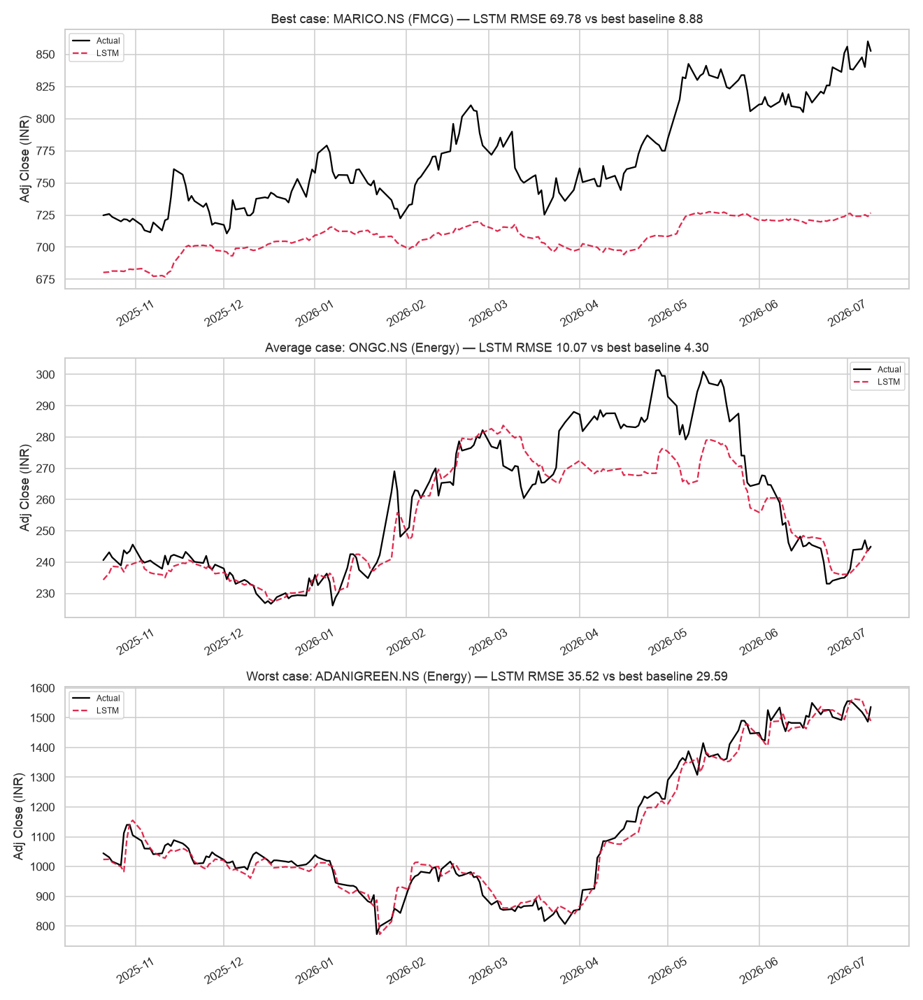
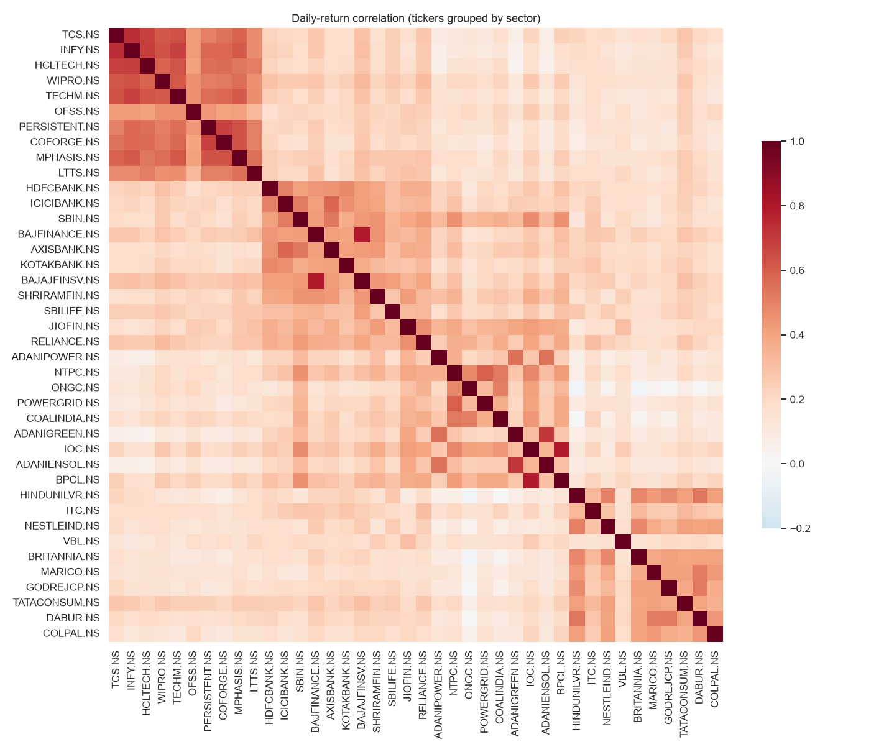
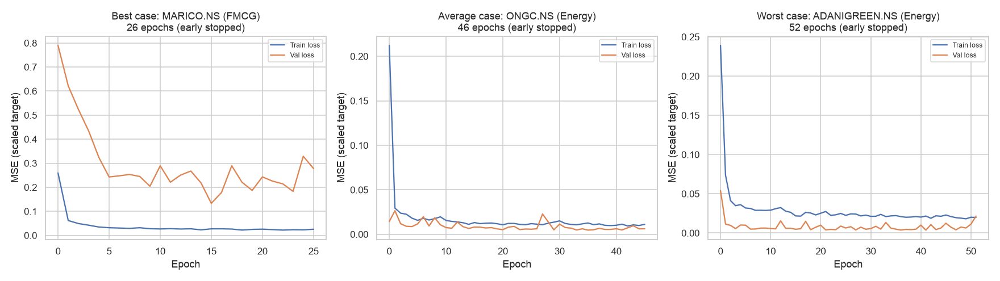

# Sector-Comparative Indian Equity Forecasting with LSTM

Honest, baseline-anchored comparison of an LSTM against naive/linear-regression/ARIMA models for next-day price prediction across 40 NSE stocks in 4 sectors — built to show *where* deep learning helps and where it doesn't, not to oversell it.

## 🔗 Live demo

**[sector-comparative-equity-lstm.streamlit.app](https://sector-comparative-equity-lstm.streamlit.app)**

Pick a sector and stock, see actual vs. LSTM-predicted price, and the full 4-model comparison — including the sector-by-sector verdict on whether the LSTM actually earned its complexity.

> **Not investment advice.** This is a portfolio project demonstrating ML technique on Indian equity data. Stock-price predictability is fundamentally limited by market efficiency; the point of this project is a *rigorous, honest* model comparison, not a trading signal.

---

## Problem statement

Most "stock price LSTM" portfolio projects report a single model's accuracy and stop there — no baseline, no honest failure analysis, and often a leaky evaluation setup that makes the numbers look better than they are. This project asks a narrower, more defensible question: for next-day closing-price prediction on Indian equities, **does an LSTM actually outperform much simpler models once both are evaluated identically and fairly** — same information cutoff, same chronological split, same metrics — or does the added complexity buy nothing? The answer is investigated per stock and per sector across Information Technology, Banking & Financial Services, Energy, and FMCG, and reported without softening it.

---

## Data & universe

**40 stocks: the top 10 by market capitalisation in each of 4 NSE sectors**, selected via a two-step process documented in [`src/universe.py`](src/universe.py):

1. **Sector membership** comes from NSE sectoral-index constituents (Nifty IT / Bank & Financial Services / Energy / FMCG), curated as candidate pools since `nseindia.com` blocks programmatic scraping.
2. **Ranking** uses **live market capitalisation pulled from Yahoo Finance** at fetch time, keeping the top 10 per sector.

The result is locked to [`config/universe.json`](config/universe.json) with the market-cap source and fetch date — **as of 2026-07-14** — and never silently re-ranked. One deviation is recorded there: LTIMindtree (LTIM) is excluded from IT because Yahoo Finance carries no price data for it under any symbol, so OFSS takes the 10th slot.

- **Time period:** 5 years of daily data ending at the fetch date.
- **Adjusted prices:** downloaded with `auto_adjust=False`, modelled on **`Adj Close`** throughout so Indian equities' frequent splits and bonus issues are handled correctly (verified in the EDA notebook — Coal India's historical `Adj Close/Close` ratio diverges by up to 34%, confirming the adjustment is doing real work).
- **Coverage caveat:** 39 of 40 tickers span the full ~1,236 trading days; **JIOFIN** (Jio Financial Services) only has ~715 days, since it listed in August 2023 after demerging from Reliance.

---

## Approach

**Features** (9 per stock, via `pandas_ta` — not hand-rolled formulas, [`src/features.py`](src/features.py)): daily return, 5/20/50-day moving averages, RSI(14), MACD + signal line, 20-day rolling volatility, and volume ratio. Raw OHLCV never reaches any model — only these engineered features (asserted, not just claimed, in [`notebooks/02_feature_engineering.ipynb`](notebooks/02_feature_engineering.ipynb)).

**Models compared, in order of increasing complexity** ([`src/baselines.py`](src/baselines.py), [`src/lstm_model.py`](src/lstm_model.py)):

| Model | How it predicts tomorrow's close |
|---|---|
| Naive | tomorrow = today |
| Linear Regression | today's 9 engineered features → tomorrow's close |
| ARIMA(5,1,0) | walk-forward one-step: append each day's realised close, forecast one step ahead |
| LSTM | 2 stacked LSTM layers (64 units), Dropout(0.2), Dense head, on 30-day sequences of scaled features |

**Chronological split — why it matters:** train/val/test are split **70/15/15 by date, never shuffled**. Random splitting on time series lets the model train on data from *after* the point it's being tested on — a common and serious leakage bug in naive implementations. Every model here is also held to the same **"predict day *t+1* using only information through day *t*"** cutoff, so no model gets an informational advantage over another — including the LSTM, whose 30-day input sequences borrow lookback context from the immediately preceding split (already-realised past data, not leakage) rather than losing 29 rows of test data to warm-up.

**Scaling:** `StandardScaler` is fit on the **training split only** ([`src/scaling.py`](src/scaling.py)) — for both input features and, for the LSTM, the prediction target — and applied unchanged to val/test. This is checked explicitly in the notebooks (scaled train features have mean≈0/std≈1; scaled test features do not, which is the *correct*, non-leaking behaviour).

---

## Results

Full per-stock numbers: [`results/final_comparison.csv`](results/final_comparison.csv). Sector-level summary (mean across each sector's 10 stocks):

| Sector | Naive RMSE | LinReg RMSE | ARIMA RMSE | LSTM RMSE | Naive Dir. Acc. | LinReg Dir. Acc. | ARIMA Dir. Acc. | LSTM Dir. Acc. |
|---|---|---|---|---|---|---|---|---|
| Information Technology | 58.34 | 63.72 | 58.68 | **125.40** | 2.5% | 49.9% | 48.8% | 49.1% |
| Banking & Financial Services | 17.05 | 18.76 | 17.03 | **89.80** | 2.7% | 48.5% | 51.0% | 50.3% |
| Energy | 11.04 | 12.61 | 11.13 | **22.46** | 2.6% | 49.0% | 50.9% | 50.6% |
| FMCG | 21.34 | 23.28 | 21.40 | **44.07** | 2.5% | 47.5% | 49.0% | 50.6% |
| **Overall (40 stocks)** | — | — | — | — | **2.6%** | **48.7%** | **50.0%** | **50.1%** |

**RMSE win count across all 40 stocks: Naive 29, ARIMA 11, Linear Regression 0, LSTM 0.**

<p align="center">
  
</p>

<p align="center">
  
</p>

<p align="center">
  
</p>

---

## Key findings

**The headline result: the LSTM did not beat the simpler models — anywhere.** Across all four sectors, its ability to predict *direction* (will tomorrow's price be higher or lower than today's) was statistically indistinguishable from a coin flip, exactly matching linear regression and ARIMA — and its prediction *error* (RMSE) was two to five times worse than every other model, despite roughly 30 epochs of training per stock versus none for the baselines.

That second half is the more interesting failure, and it's diagnosable rather than mysterious. Looking at the chart above, on stocks that rallied to new highs during the test period (Marico is the clearest example), the LSTM's predictions flatten out near the top of the price range it saw during training and never catch up to the real, higher prices that followed. This isn't a bug — it's a structural consequence of how the model was trained: its output scaler was fit only on training-period prices (correctly, to avoid leaking future information), so it has no way to output a number outside the range it learned from, the same way a student can't answer an exam question about material the course never covered. The simpler models don't have this problem because they don't try to learn a price range at all — the naive model just repeats today's price, and ARIMA anchors to it each step.

The more revealing test, though, is not RMSE but **directional accuracy** — whether a model can consistently call up-or-down correctly, which is the version of "predicting the market" that would actually matter to a trader. Here the naive model's near-zero score is itself informative: because it always "predicts" no change, it can never be right about a real up or down move except by accident, which quantifies just how easy it is for a low-error model to have zero actual predictive skill. Linear regression and ARIMA land close to 50% — essentially a coin flip, but a genuine one, since they at least commit to a direction each day. **The LSTM's job was to clear that ~50% bar by a meaningful margin. It didn't, in any of the four sectors** — every gap versus the best baseline was within about one percentage point, statistical noise around a coin flip.

**Bottom line for a hiring manager:** deep learning is not a free upgrade over classical time-series methods — on this task, with this feature set, it added substantial training cost and complexity for measurably worse price accuracy and no directional edge. That's a legitimate, common outcome in applied ML, and reporting it plainly — rather than cherry-picking a metric that looks better — is the actual differentiator of this project versus a typical "I built a stock LSTM" portfolio piece.

---

## Tech stack

- **Language:** Python 3.12 (required by `pandas-ta`'s current PyPI release)
- **Data:** `yfinance` (NSE `.NS` tickers), 5 years daily, adjusted close
- **Feature engineering:** `pandas-ta`
- **Baselines:** `scikit-learn` (linear regression), `statsmodels` (ARIMA)
- **Deep learning:** TensorFlow / Keras (LSTM)
- **Evaluation:** custom `compute_metrics` (RMSE, MAE, MAPE, directional accuracy) shared identically across all 4 models
- **Deployment:** Streamlit + Streamlit Community Cloud, Plotly for charts
- **Notebooks:** Jupyter, executed end-to-end via `nbconvert` (no manual-only cells)
- **Version control:** Git + GitHub

---

## How to reproduce locally

```bash
git clone https://github.com/pranavchauhann/sector-comparative-equity-lstm.git
cd sector-comparative-equity-lstm

python3.12 -m venv .venv && source .venv/bin/activate   # pandas-ta requires Python >=3.12
pip install -r requirements.txt

# Build the data pipeline (Phases 1-2)
python src/universe.py                     # build & lock config/universe.json
python src/data_loader.py                  # cache 5yr adjusted data for all 40 tickers

# Run the notebooks in order — each runs top-to-bottom with no manual steps
jupyter nbconvert --to notebook --execute --inplace notebooks/01_universe_and_eda.ipynb
jupyter nbconvert --to notebook --execute --inplace notebooks/02_feature_engineering.ipynb
jupyter nbconvert --to notebook --execute --inplace notebooks/03_baselines.ipynb
jupyter nbconvert --to notebook --execute --inplace notebooks/04_lstm.ipynb   # ~6-7 min on CPU

# Run the dashboard locally
streamlit run app/app.py
```

To refresh the market-cap snapshot (rather than use the locked, dated one), re-run `python src/universe.py` explicitly — no other script does this automatically. Full Streamlit Community Cloud deployment steps (including why the app uses a separate, lean `app/requirements.txt`) are in [DEPLOY.md](DEPLOY.md).

---

## Limitations & future work

- **Price-level prediction, not returns.** As the Key Findings section shows, predicting a scaled *price level* structurally caps the LSTM at the training period's price range. Predicting *returns* instead (scale-free, no upper bound issue) is the standard fix and the most promising next step.
- **No macroeconomic, news, or sentiment features.** All 9 features are derived purely from each stock's own OHLCV history. Sector-wide or market-wide signals (interest rates, crude oil prices for Energy, USD/INR for IT, earnings calendars) are absent, and Phase 1's EDA already shows meaningful *inter*-sector correlation that pure single-stock features can't capture.
- **Single-stock models, not a portfolio approach.** Each of the 40 LSTMs is trained independently; there's no shared representation across a sector or joint portfolio-level objective, which is likely part of why sector-wide patterns aren't being exploited.
- **LSTM architecture was not extensively tuned.** Units (64), dropout (0.2), sequence length (30 days), and learning rate all used reasonable defaults rather than a search — deliberate, given the point of this project was a fair baseline comparison rather than squeezing out maximum LSTM performance, but it means the "LSTM loses" finding is about this specific, untuned architecture, not a proof that no LSTM configuration could do better.
- **ARIMA order was fixed, not searched.** `(5,1,0)` with a short fallback list was used per stock rather than a full grid search (e.g. via `auto_arima`), since ARIMA's role here is a classical reference point, not the model under study.

## License

[MIT](LICENSE)
