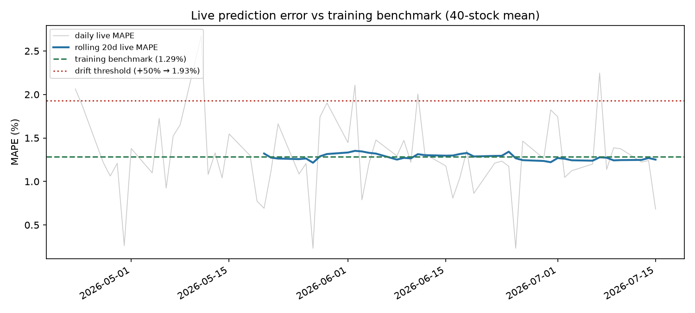

# Drift Detection (Phase 4)

Phase 3's weekly retrain is scheduled but blind: if the market shifts
sharply on a Tuesday, the model serves degraded predictions until Sunday.
Phase 4 closes that gap with a **daily drift check** that can dispatch the
retraining workflow out of schedule — and with guardrails rigorous enough
that a flag means something.

## The two detectors, and why both

| | Performance drift | Data drift |
|---|---|---|
| **Question** | "Are the model's *errors* worse than at training time?" | "Are the model's *inputs* still distributed like the training data?" |
| **Module** | [src/drift_performance.py](../src/drift_performance.py) | [src/drift_data.py](../src/drift_data.py) |
| **Needs** | Realised actuals (next trading day, per prediction) | Nothing but today's features |
| **Catches** | Any degradation, whatever the cause | Regime changes and broken feeds — *before* errors accumulate |

They are complementary because of **latency**: performance drift is the
ground truth but needs ~20 trading days of realised errors to move a
rolling average. Data drift needs zero. Realistic scenario where data
drift fires first: a volatility regime change — say a policy shock trebles
daily volatility overnight. `volatility_20` and `daily_return`
distributions shift on day one and PSI flags within days, while the
rolling 20-day MAPE still mostly averages over pre-shock days and won't
cross its threshold for two weeks. Same story for a broken upstream feed
(stale prices → `volatility_20` collapses toward zero, `volume_ratio`
goes degenerate): data drift catches it the next morning, before bad
predictions even have realised actuals to be scored against.

## The live error stream: shadow evaluation log

[src/log_predictions.py](../src/log_predictions.py) maintains
`data/prediction_log.csv`: every run appends a fresh next-trading-day
prediction per stock (timestamped **before** the actual is knowable) and
backfills actuals + absolute percentage errors for predictions whose
target date has since realised. `--replay N` bootstraps history by
walking the recent N trading days (still shadow evaluation — that window
is in the models' test period, not their training data). The log is
committed to git deliberately: it is the one artifact that *cannot* be
regenerated, because it records what the model said in advance.

## Performance drift: threshold + statistical confirmation

Two conditions, **both** required:

1. **Magnitude** — rolling 20-day live MAPE > training benchmark
   ([config/current_model_metrics.json](../config/current_model_metrics.json))
   × 1.5. The +50% relative threshold is wide by design: daily MAPE on
   this universe routinely spikes past 2% on single days (see the monitor
   plot) while the rolling mean sits at ~1.25%; a sustained +50% excess
   (≥1.93%) does not happen without genuine degradation.
2. **Significance** — one-sided Mann-Whitney U comparing the recent 20
   days of per-prediction APEs against the preceding ≤60-day reference
   window, p < 0.01. Mann-Whitney over a t-test because APEs are
   heavy-tailed; over KS because the question is specifically "did errors
   get *bigger*" (a location shift), not "did anything change".

One huge outlier day fails the magnitude test → no flag. A statistically
real but small creep fails magnitude too → absorbed by the weekly
retrain. Only "large AND real" spends an out-of-schedule retrain.

## Data drift: PSI against an empirically calibrated null

Per stock × feature: PSI (10 decile bins fit on the training split,
0.5-count smoothing) of the most recent 30 trading days vs that stock's
chronological 70% training split.

Two design decisions that make this a detector worth trusting — both
found the hard way (the naive version was built, measured, and rejected):

1. **Stationarity transform first.** Raw moving averages and MACD trend
   with price, so their distributions *always* diverge from a years-old
   training window — naive PSI flagged all 9 features on day one. Level
   features are divided by that day's price (`ma_20/price` = "distance
   from trend"); returns, RSI, volatility, volume-ratio are scale-free
   already.
2. **Empirical null instead of the textbook 0.25 cutoff.** The industry
   PSI bands assume independent samples. Thirty *consecutive* trading
   days are heavily autocorrelated — measured on this universe, 30-day
   windows from **inside the training period itself** score median PSI
   0.2–1.6, so the 0.25 cutoff flags permanent drift on the model's own
   training data. Instead, each stock × feature gets a null distribution
   of PSIs from sliding in-train windows (10-day step), and the recent
   window flags only above its own **95th percentile**. Verified: on
   clean current data, 5–10% of stocks exceed their null per feature —
   exactly the false-positive rate a p95 threshold predicts.

**Aggregation**: a feature is drifted when >50% of the 40 stocks exceed
their own null — one stock's split or crash can't trigger a retrain, a
universe-wide shift by definition does. The report lists *which* features
drifted and each one's worst offenders (diagnosis, not just detection).

## Wiring: daily check → out-of-schedule retrain

[.github/workflows/drift-check.yml](../.github/workflows/drift-check.yml)
runs weekdays at 12:00 UTC (after NSE close): refreshes data, updates the
shadow log, runs both detectors (verdicts → job summary), commits the log,
and — if either detector flags — dispatches the Phase 3
[weekly-retrain workflow](../.github/workflows/retrain.yml) immediately via
`gh workflow run`. The promotion gate still applies to the resulting
model: drift triggers a *candidate*, never an automatic replacement.

## Monitoring

`python src/drift_performance.py --plot` regenerates
[results/plots/drift_monitor.png](../results/plots/drift_monitor.png):
daily live MAPE (noisy grey), rolling 20-day mean (blue), training
benchmark (green dashed), drift threshold (red dotted).

## Proof the detectors work

[scripts/simulate_drift.py](../scripts/simulate_drift.py) injects synthetic
drift into temp copies of the data and asserts all four outcomes; full log
in [results/drift_logs/synthetic_drift_proof.log](../results/drift_logs/synthetic_drift_proof.log):

| scenario | expected | result |
|---|---|---|
| clean data | no data drift | ✅ pass |
| crash-regime shock (vol ×3, returns −2%/day, RSI crushed, volume ×2) on last 30d | data drift | ✅ flagged — and *only* the four shocked features (`rsi_14`, `volatility_20`, `daily_return`, `volume_ratio`), not the untouched MAs |
| clean shadow log | no performance drift | ✅ pass |
| recent APEs × 2.5 (rolling MAPE 3.1% vs 1.29% benchmark) | performance drift | ✅ flagged (magnitude + Mann-Whitney p ≪ 0.01) |
